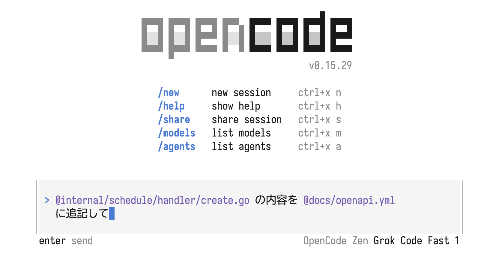

# OpenAPIのドキュメント

## 書き方

- `docs/openapi.yml`に記載する
- 本プロジェクトではswaggoなどの自動生成系は使わない
- AIエージェントなどを使い記載することを推奨する

## AIを使用した生成例

あくまで例なので、必ずこの方法で記載する必要はない

### 1. エージェントをインストール

無料で利用できる [opencode](https://github.com/sst/opencode) をインストールする

```bash
npm i -g opencode-ai@latest        # or bun/pnpm/yarn
```

※  [公式のインストールドキュメント](https://github.com/sst/opencode?tab=readme-ov-file#installation)

### 2. opencodeを起動

```bash
opencode
```

### 3. ドキュメントを生成

opencodeにファイルを指定してプロンプトを投げる


